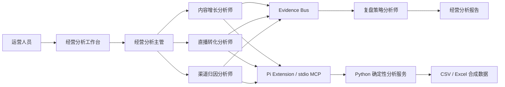

# MiniClaw 电商运营数据分析多 Agent 工作台

面向内容运营、直播运营、渠道运营和销售转化场景的经营分析工作台。项目基于 **MiniClaw / Pi Agent Runtime、Python、FastAPI、Pandas、Pydantic、JSON Schema 与 stdio MCP**，将分散的业务数据组织为可追溯的“数据接入—指标诊断—维度钻取—策略生成—行动复验”分析闭环。

工作台采用“一主四专”协作结构，由经营分析主管负责目标拆解、任务路由和结果校验，四类专业角色分别承担内容增长、直播转化、渠道归因与复盘策略工作。

> 项目公开数据均为 `synthetic=true` 的合成演示数据，不包含真实客户、订单或经营隐私信息。


## 项目价值

电商经营分析通常涉及短视频、直播场次、渠道线索、销售跟进和订单等多张业务表。人工处理容易出现数据口径不一致、排查过程难以复现、诊断与行动脱节等问题。

本项目围绕这些问题构建统一的经营分析工作台：

- 将跨表清洗、指标计算和维度聚合封装为确定性工具服务。
- 将经营目标拆解为可路由的内容、直播和渠道分析任务。
- 通过 `run_id` 串联数据、指标、发现、行动与复验标准。
- 使用角色级工具权限控制不同专业角色的能力边界。
- 通过结构化结果协议区分 `completed`、`partial`、`blocked` 和 `uncertain`。
- 将分析结论转化为责任岗位、执行时限和复验指标明确的行动方案。
- 支持内置样例与多文件上传，便于进行功能展示和业务沟通。

## 业务分析链路

```text
短视频曝光
    ↓
内容互动与点击
    ↓
直播间承接
    ↓
渠道线索进入
    ↓
销售跟进
    ↓
订单转化
    ↓
经营复盘与行动复验
```

工作台围绕三个专业分析域组织数据：

| 分析域 | 主要数据 | 重点指标 | 输出方向 |
|---|---|---|---|
| 内容增长 | 短视频、账号、发布时间 | 曝光、互动、点击、内容效率 | 内容选题、发布时间、账号策略 |
| 直播转化 | 直播场次、观看、互动、商品点击、订单 | 观看转化、点击率、下单率、成交漏斗 | 场次结构、承接环节、转化优化 |
| 渠道线索 | 渠道、线索、负责人、跟进、订单 | 有效线索率、跟进率、成交率、渠道贡献 | 渠道调整、跟进节奏、负责人协同 |

## 一主四专协作模式

| 角色 | 职责 | 数据与工具边界 | 主要产出 |
|---|---|---|---|
| 经营分析主管 | 理解经营目标、拆解任务、选择专业角色、校验结果 | 负责调度与汇总，不直接计算业务指标 | 分析计划、任务路由、综合结论 |
| 内容增长分析师 | 分析短视频、账号和内容表现 | 内容数据检查、短视频分析、内容维度钻取 | 内容发现、增长机会、内容动作 |
| 直播转化分析师 | 分析直播观看、点击、留资和成交漏斗 | 直播数据检查、直播漏斗分析、场次钻取 | 漏斗发现、异常环节、转化动作 |
| 渠道归因分析师 | 分析渠道、线索、跟进和订单关联 | 渠道数据检查、线索归因、渠道钻取 | 渠道贡献、跟进问题、归因结论 |
| 复盘策略分析师 | 将诊断结果转化为可执行策略 | 读取经过校验的诊断包，不直接修改业务数据 | 行动、责任岗位、时限、复验指标 |

### 协作原则

1. 经营分析主管根据目标选择需要参与的专业角色。
2. 专业角色先检查数据结构，再执行所属领域的分析工具。
3. 每项发现必须引用对应的指标证据。
4. 复盘策略分析师只接收结构化诊断包。
5. 行动建议必须包含责任岗位、执行期限和复验指标。
6. 无稳定关联键时停止归因，无成本字段时不计算 ROI。
7. 对可能产生副作用的操作采用 fail-closed 策略，避免盲目重跑。

## 功能演示

工作台提供两种数据入口：

- **内置样例**：直接运行项目内置的三域合成数据。
- **上传合成数据**：上传 CSV、XLS、XLSX 或 XLSM 文件，最多支持 6 个文件。


上传数据后，可以完成以下操作：

1. 选择内容增长、直播转化或渠道线索分析域。
2. 填写本次经营分析目标。
3. 运行数据检查与指标计算。
4. 查看核心指标、经营发现和证据引用。
5. 按渠道、场次、账号、内容或负责人进行维度钻取。
6. 查看角色协作时间线和证据交接过程。
7. 生成行动方案、责任岗位和复验指标。
8. 下载结构化 JSON 分析报告。

## 系统架构



系统分为五层：

### 1. 交互层

由 `web/` 目录中的页面、样式和交互脚本组成，负责数据上传、分析域切换、结果展示、维度钻取和报告下载。

### 2. API 层

基于 FastAPI 提供场景读取、分析运行、结果查询和报告下载接口，并负责文件类型、数量及请求参数校验。

### 3. 编排层

负责创建 `workflow_run_id`，组织多业务域分析过程，并生成角色时间线、证据包和行动复验方案。

### 4. 确定性分析层

基于 Pandas、Pydantic 和业务规则执行：

- 数据读取与字段识别
- 空值和重复记录处理
- 指标口径计算
- 漏斗分析
- 渠道与负责人聚合
- 异常阈值判断
- 维度钻取
- 结构化结果生成

### 5. MiniClaw 接入层

通过 Pi Agent Runtime、Pi Subagent、project-local extension 和 stdio MCP 组织角色配置、工具映射及角色级权限，使专业能力能够按照统一契约被调用。

## 证据链设计

每一次分析都会生成独立的 `run_id`，并围绕以下结构组织结果：

```text
DatasetManifest
    ↓
AnalysisPacket
    ↓
Evidence
    ↓
Finding
    ↓
Action
    ↓
VerificationMetric
    ↓
DeliveryPackage
```

核心关系为：

```text
evidence → finding → action → verification_metric
```

例如：

```text
证据：某直播场次商品点击率明显低于目标值
  ↓
发现：商品讲解后的点击承接偏弱
  ↓
行动：调整商品讲解顺序并增加利益点提示
  ↓
复验：下一场直播商品点击率达到设定目标
```

这种设计让每条建议都能返回对应指标和数据范围，便于复盘、沟通和持续优化。

## 核心工具

项目提供五类只读经营分析工具：

| 工具 | 作用 |
|---|---|
| `inspect_commerce_data` | 检查数据集、字段结构、文件关系和分析前置条件 |
| `analyze_short_video_data` | 计算短视频和内容增长指标 |
| `analyze_live_commerce_data` | 计算直播观看、互动、点击和成交漏斗 |
| `analyze_attribution_and_leads` | 分析渠道、线索、跟进与订单归因 |
| `drilldown_commerce_metric` | 按渠道、账号、场次、内容或负责人钻取指标 |

工具调用受角色级 allowlist 约束，专业角色只能调用所属业务域允许的工具。

## 技术栈

| 类型 | 技术 |
|---|---|
| Agent 平台 | MiniClaw、Pi Agent Runtime、Pi Subagent |
| 后端 | Python、FastAPI |
| 数据处理 | Pandas |
| 数据建模 | Pydantic |
| 工具协议 | MCP、stdio |
| 契约 | JSON Schema |
| 前端 | HTML、CSS、JavaScript |
| 数据格式 | CSV、XLS、XLSX、XLSM、JSON |
| 质量机制 | 场景评测集、硬门槛规则、结构化轨迹与回归报告 |

## 快速启动

### 环境要求

- Python 3.10+
- Windows、macOS 或 Linux
- 建议使用独立的 Python 虚拟环境

### 1. 获取项目

```bash
git clone https://github.com/<your-github-name>/miniclaw-commerce-ops.git
cd miniclaw-commerce-ops
```

请将 `<your-github-name>` 替换为你的 GitHub 用户名。

### 2. 创建虚拟环境

Windows：

```powershell
python -m venv .venv
.venv\Scripts\activate
```

macOS / Linux：

```bash
python3 -m venv .venv
source .venv/bin/activate
```

### 3. 安装依赖

```bash
python -m pip install -r requirements.txt
```

### 4. 启动服务

```bash
python -m uvicorn commerce_ops.app:app --host 127.0.0.1 --port 3022
```

### 5. 打开工作台

浏览器访问：

```text
http://127.0.0.1:3022/demo
```

## API 接口

| 方法 | 路径 | 作用 |
|---|---|---|
| GET | `/` | 跳转至工作台页面 |
| GET | `/demo` | 打开功能演示界面 |
| GET | `/health` | 获取服务状态 |
| GET | `/v1/demo/scenarios` | 获取内置业务场景 |
| POST | `/v1/demo/runs/sample` | 运行内置三域样例 |
| POST | `/v1/demo/runs/upload` | 上传合成数据并运行分析 |
| GET | `/v1/demo/runs/{workflow_run_id}` | 查询指定分析结果 |
| GET | `/v1/demo/runs/{workflow_run_id}/report` | 下载结构化 JSON 报告 |

## 项目目录

```text
miniclaw-commerce-ops/
├── commerce_ops/       # 数据处理、业务工具、编排与 API
├── config/             # AgentProfile 与 Workspace 配置模板
├── contracts/          # Workflow Schema 与输入输出契约
├── data/               # 合成演示数据
├── docs/               # 架构、工具、接入和使用文档
│   └── images/         # README 展示图片
├── evals/              # 场景用例、评分规则和结果模板
├── integrations/       # Plugin 与 MCP 接入资产
├── scripts/            # 项目校验和报告脚本
├── tests/              # 自动化质量保障代码
├── web/                # 工作台页面、样式与交互
├── requirements.txt    # Python 依赖
└── README.md           # 项目说明
```

## 数据要求

为了保护业务隐私，公开仓库中的数据均采用合成样例。

上传文件时建议遵循以下原则：

- 不上传姓名、手机号、地址或身份信息。
- 不上传真实客户、订单和内部经营数据。
- 不在文件中保存 API Key、Cookie 或账号凭据。
- 使用稳定的匿名 ID 关联线索、跟进和订单记录。
- 在需要计算渠道贡献时提供可靠的关联字段。
- 在需要计算成本类指标时明确提供成本字段和计算口径。

## 设计特点

### 确定性计算与 Agent 推理分层

指标计算、清洗、聚合和阈值判断交给 Python 工具；目标理解、任务路由、结果解释和行动组织由 Agent 层负责。这样可以兼顾分析灵活性与数据口径稳定性。

### 角色级工具权限

每个专业角色只拥有其职责范围内的工具。经营分析主管负责任务路由，不直接计算业务指标；复盘策略分析师根据诊断包生成行动方案，不读取原始业务文件。

### 状态语义明确

工作流使用四种结果状态：

- `completed`：分析链路正常结束。
- `partial`：部分数据或部分分析域可用。
- `blocked`：关键前置条件不满足，停止继续处理。
- `uncertain`：证据不足，保留不确定性并交由人工判断。

### 只读分析

项目默认对上传数据执行只读处理，不写入 CRM、订单系统、投放平台或其他外部业务系统。

### 可追溯交付

结构化报告保留输入数据标识、运行标识、指标证据、经营发现、行动方案及复验标准，便于后续审阅和业务复盘。

## 适用场景

- 电商内容周报与月度经营复盘
- 短视频内容增长分析
- 直播场次转化漏斗诊断
- 渠道线索质量与销售跟进分析
- 订单归因与渠道贡献分析
- AI Agent 工具调用和多角色协作方案展示
- FastAPI、MCP 与结构化 Workflow 工程实践

## 项目边界

MiniClaw 提供 Agent Runtime、Subagent 调度、Plugin Catalog 等平台能力；本项目聚焦电商经营分析场景中的业务建模、确定性工具服务、角色协作契约、MCP 接入、证据链、质量规则和功能演示。

项目页面输出用于经营分析辅助，实际业务决策应结合业务负责人对数据口径、经营目标和执行条件的判断。
